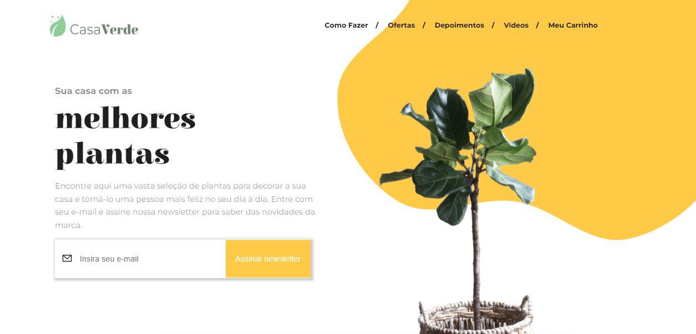
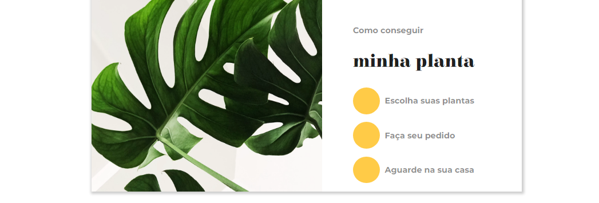
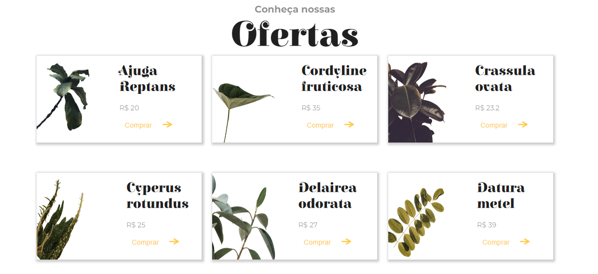

# 

Projeto desenvolvido do Desafio da alura  ```7 days of Code - React```


Uma landing Page de uma loja de plantas.
A [Casa Verde](https://7-days-of-code-react-snowy.vercel.app/)

Esse projeto faz parte de desafios da Alura que servem para ampliar e testar o repertório. São 7 dias de desenvolvimento que colocam requisitos para a conclusão, finalizando com um lindo projeto.

## Tools🛠
- React
- Styled Components

## Seções do Site




